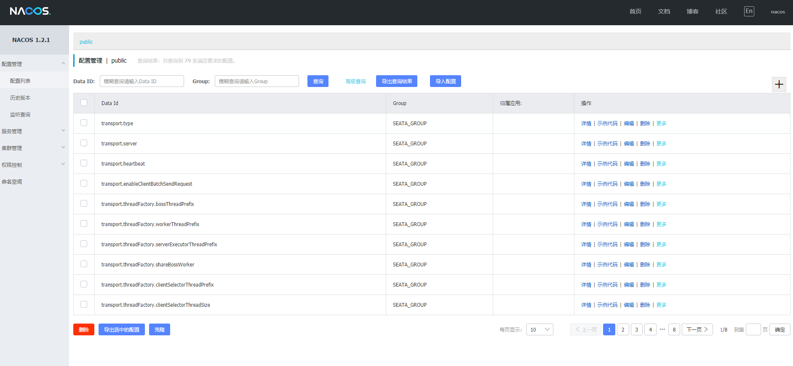
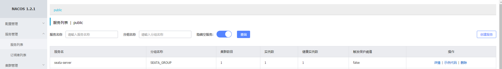
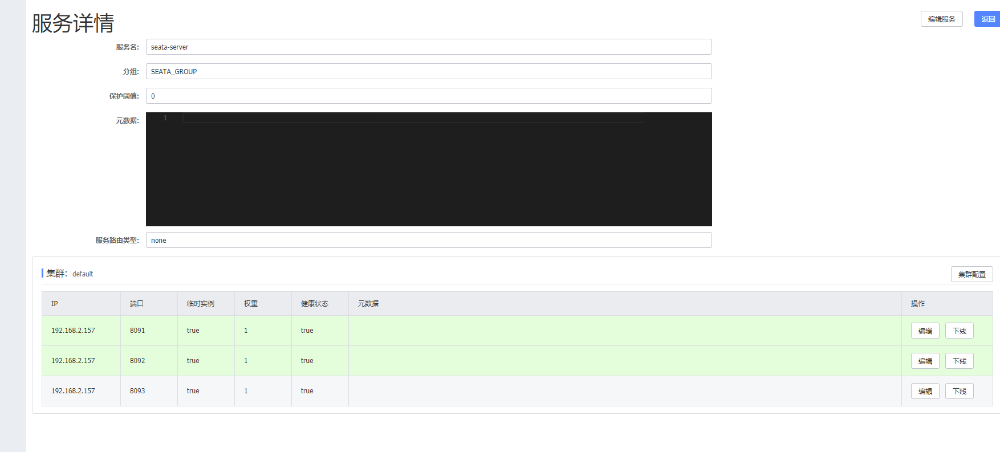

###seata分布式事务搭建
#####一、seata-server搭建
**执行以下方法的时候需要保证nacos启动**
- 下载seata-server  
    地址:https://github.com/seata/seata/releases/tag/v1.3.0
- 解压seata-server的包，修改conf下的file.conf和registry.conf文件
    - 需要注意的是这个file.conf是给seata-server使用的
    - 当然这个文件可以在本地配置，也可以配置在服务端，这里配置到nacos
    - 所以需要修改registry下的type 为 "nacos",registry和config都要修改
    - 本地存储也使用db方式，所以也需要修改store为db，具体配置如下
    
    `file.conf`
    
    
    ##transaction log store, only used in seata-server
    store {
      ## store mode: file、db、redis
      #这里修改为db
      mode = "db"
    
      ## file store property
      file {
        ## store location dir
        dir = "sessionStore"
        # branch session size , if exceeded first try compress lockkey, still exceeded throws exceptions
        maxBranchSessionSize = 16384
        # globe session size , if exceeded throws exceptions
        maxGlobalSessionSize = 512
        # file buffer size , if exceeded allocate new buffer
        fileWriteBufferCacheSize = 16384
        # when recover batch read size
        sessionReloadReadSize = 100
        # async, sync
        flushDiskMode = async
      }
    
      ## database store property
      db {
        ## the implement of javax.sql.DataSource, such as DruidDataSource(druid)/BasicDataSource(dbcp)/HikariDataSource(hikari) etc.
        datasource = "druid"
        ## mysql/oracle/postgresql/h2/oceanbase etc.
        dbType = "mysql"
        #如果你是mysql8.0以上,则修改这里的驱动,不是则不修改
        driverClassName = "com.mysql.jdbc.Driver"
        url = "jdbc:mysql://127.0.0.1:3306/seata?useUnicode=true&useSSL=false&characterEncoding=utf8&serverTimezone=UTC"
        user = "root"
        password = "123456"
        minConn = 5
        maxConn = 30
        globalTable = "global_table"
        branchTable = "branch_table"
        lockTable = "lock_table"
        queryLimit = 100
        maxWait = 5000
      }
    
      ## redis store property
      redis {
        host = "127.0.0.1"
        port = "6379"
        password = ""
        database = "1"
        minConn = 1
        maxConn = 10
        queryLimit = 100
      }
    
    }

`registry.conf`

    registry {
      # file 、nacos 、eureka、redis、zk、consul、etcd3、sofa
      type = "nacos"
    
      nacos {
        application = "seata-server"
        serverAddr = "127.0.0.1:8848"
        group = "SEATA_GROUP"
        namespace = ""
        cluster = "default"
        username = "nacos"
        password = "nacos"
      }
      eureka {
        serviceUrl = "http://localhost:8761/eureka"
        application = "default"
        weight = "1"
      }
      redis {
        serverAddr = "localhost:6379"
        db = 0
        password = ""
        cluster = "default"
        timeout = 0
      }
      zk {
        cluster = "default"
        serverAddr = "127.0.0.1:2181"
        sessionTimeout = 6000
        connectTimeout = 2000
        username = ""
        password = ""
      }
      consul {
        cluster = "default"
        serverAddr = "127.0.0.1:8500"
      }
      etcd3 {
        cluster = "default"
        serverAddr = "http://localhost:2379"
      }
      sofa {
        serverAddr = "127.0.0.1:9603"
        application = "default"
        region = "DEFAULT_ZONE"
        datacenter = "DefaultDataCenter"
        cluster = "default"
        group = "SEATA_GROUP"
        addressWaitTime = "3000"
      }
      file {
        name = "file.conf"
      }
    }
    
    config {
      # file、nacos 、apollo、zk、consul、etcd3
      type = "nacos"
    
      nacos {
        serverAddr = "127.0.0.1:8848"
        namespace = ""
        group = "SEATA_GROUP"
        username = "nacos"
        password = "nacos"
      }
      consul {
        serverAddr = "127.0.0.1:8500"
      }
      apollo {
        appId = "seata-server"
        apolloMeta = "http://192.168.1.204:8801"
        namespace = "application"
      }
      zk {
        serverAddr = "127.0.0.1:2181"
        sessionTimeout = 6000
        connectTimeout = 2000
        username = ""
        password = ""
      }
      etcd3 {
        serverAddr = "http://localhost:2379"
      }
      file {
        name = "file.conf"
      }
    }

- 配置上传到nacos配置中心的configl.txt
   
     - 其中service.vgroupMapping.my_test_tx_group=default要与client端的一致,这里就先默认default
     - 上传文件的脚本nacos-config.sh  
       下载地址:https://github.com/seata/seata/tree/v1.3.0/script/config-center/nacos
     - 特别的脚本要和config.txt要放在同目录下，或者隔一层目录
     
     `config.txt如下` 

         transport.type=TCP
         transport.server=NIO
         transport.heartbeat=true
         transport.enableClientBatchSendRequest=false
         transport.threadFactory.bossThreadPrefix=NettyBoss
         transport.threadFactory.workerThreadPrefix=NettyServerNIOWorker
         transport.threadFactory.serverExecutorThreadPrefix=NettyServerBizHandler
         transport.threadFactory.shareBossWorker=false
         transport.threadFactory.clientSelectorThreadPrefix=NettyClientSelector
         transport.threadFactory.clientSelectorThreadSize=1
         transport.threadFactory.clientWorkerThreadPrefix=NettyClientWorkerThread
         transport.threadFactory.bossThreadSize=1
         transport.threadFactory.workerThreadSize=default
         transport.shutdown.wait=3
         service.vgroupMapping.my_test_tx_group=default
         service.default.grouplist=127.0.0.1:8091
         service.enableDegrade=false
         service.disableGlobalTransaction=false
         client.rm.asyncCommitBufferLimit=10000
         client.rm.lock.retryInterval=10
         client.rm.lock.retryTimes=30
         client.rm.lock.retryPolicyBranchRollbackOnConflict=true
         client.rm.reportRetryCount=5
         client.rm.tableMetaCheckEnable=false
         client.rm.sqlParserType=druid
         client.rm.reportSuccessEnable=false
         client.rm.sagaBranchRegisterEnable=false
         client.tm.commitRetryCount=5
         client.tm.rollbackRetryCount=5
         client.tm.degradeCheck=false
         client.tm.degradeCheckAllowTimes=10
         client.tm.degradeCheckPeriod=2000
         store.mode=db
         store.file.dir=file_store/data
         store.file.maxBranchSessionSize=16384
         store.file.maxGlobalSessionSize=512
         store.file.fileWriteBufferCacheSize=16384
         store.file.flushDiskMode=async
         store.file.sessionReloadReadSize=100
         store.db.datasource=druid
         store.db.dbType=mysql
         store.db.driverClassName=com.mysql.cj.jdbc.Driver
         store.db.url=jdbc:mysql://127.0.0.1:3306/seata?characterEncoding=utf8&useSSL=false&serverTimezone=UTC&rewriteBatchedStatements=true&allowPublicKeyRetrieval=true
         store.db.user=root
         store.db.password=123456
         store.db.minConn=5
         store.db.maxConn=30
         store.db.globalTable=global_table
         store.db.branchTable=branch_table
         store.db.queryLimit=100
         store.db.lockTable=lock_table
         store.db.maxWait=5000
         store.redis.host=127.0.0.1
         store.redis.port=6379
         store.redis.maxConn=10
         store.redis.minConn=1
         store.redis.database=0
         store.redis.password=null
         store.redis.queryLimit=100
         server.recovery.committingRetryPeriod=1000
         server.recovery.asynCommittingRetryPeriod=1000
         server.recovery.rollbackingRetryPeriod=1000
         server.recovery.timeoutRetryPeriod=1000
         server.maxCommitRetryTimeout=-1
         server.maxRollbackRetryTimeout=-1
         server.rollbackRetryTimeoutUnlockEnable=false
         client.undo.dataValidation=true
         client.undo.logSerialization=jackson
         client.undo.onlyCareUpdateColumns=true
         server.undo.logSaveDays=7
         server.undo.logDeletePeriod=86400000
         client.undo.logTable=undo_log
         client.log.exceptionRate=100
         transport.serialization=seata
         transport.compressor=none
         metrics.enabled=false
         metrics.registryType=compact
         metrics.exporterList=prometheus
         metrics.exporterPrometheusPort=9898

- 执行nacos-config.sh命令显示上传成功
- 创建本地数据库seata 
    sql下载地址:https://github.com/seata/seata/tree/v1.3.0/script/server/db
- 在执行seata下bin下的bat或者sh文件启动seata-server

看到如下则启动成功:

#####二、seata-client引入自己业务
- pom依赖

        <dependency>
            <groupId>io.seata</groupId>
            <artifactId>seata-spring-boot-starter</artifactId>
            <version>${seata-boot.version}</version>
        </dependency>
        <dependency>
            <groupId>com.alibaba.cloud</groupId>
            <artifactId>spring-cloud-starter-alibaba-seata</artifactId>
            <version>${spring-cloud-alibaba-seata.version}</version>
            <exclusions>
                <exclusion>
                    <groupId>io.seata</groupId>
                    <artifactId>seata-spring-boot-starter</artifactId>
                </exclusion>
            </exclusions>
        </dependency>
    - spring-cloud-starter-alibaba-seata是封装了xid在服务之间传递的，需要剔除seata-spring-boot-starter,
    - 然后去依赖对应seata-server的版本的boot号，这个开启了自动数据源代理，所以只需要注入数据源就可以  
- application.yml配置    
    - vgroup_mapping.my_test_tx_group = "default"与之前seata-server的config.txt上传的要一致
    - 由于是使用的1.3.0和boot-starer，所以是支持yaml文件配置,具体配置如下:

    #seata配置
    seata:
      enabled: true
      application-id: spring-cloud-masterservice
      #这里的名字与file.conf中vgroup_mapping.my_test_tx_group = "default"相同
      tx-service-group: my_test_tx_group
      enable-auto-data-source-proxy: true
      #  use-jdk-proxy: false
      client:
        log:
          exceptionRate: 100 # 日志异常输出概率（默认100）
      service:
        #这里的名字与file.conf中vgroup_mapping.my_test_tx_group = "default"相同
        vgroup-mapping:
          my_test_tx_group: default
          #这里的名字与file.conf中default.grouplist = "127.0.0.1:8091"相同
        grouplist:
          default: 127.0.0.1:8091
        enable-degrade: false
        disable-global-transaction: false
      config:
        type: nacos
        nacos:
          namespace:
          #这里的地址就是你的nacos的地址,可以更换为线上
          serverAddr: 127.0.0.1:8848
          #这里的名字就是registry.conf中 nacos的group名字
          group: SEATA_GROUP
          userName: "nacos"
          password: "nacos"
      registry:
        type: nacos
        nacos:
          application: seata-server
          namespace:
          #这里的地址就是你的nacos的地址,可以更换为线上
          serverAddr: 127.0.0.1:8848
          #这里的名字就是registry.conf中 nacos的group名字
          group: SEATA_GROUP
          userName: "nacos"
          password: "nacos"    
- 给需要事务的库都创建如下的表 
    sql地址为: https://github.com/seata/seata/blob/v1.3.0/script/client/at/db/mysql.sql  
- 都配置完成之后启动服务，注册到nacos上,至此客户端配置完成

#####三、seata-client实际的调用方式

- 服务A调用服务B，在服务A上加全局事务注解@GlobalTransactional
- 在使用feign的被调用方出异常后需要返回给调用方code去判断，方便让调用方抛异常事务回滚
- 抛出的异常要遵循spring的异常检查机制

#####四、seata-server集群配置
- 只需要将下载的seata-server以不同端口启动即可，因为都是注册在同一个nacos上
- file.conf和registry.conf和config.txt都不需要改变    

