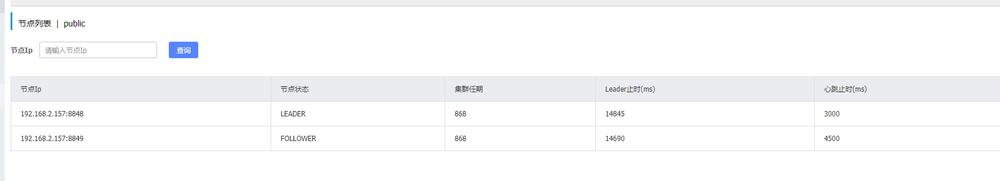

###nacos配合nginx搭建集群
#####一、nginx配置(windows版本)
- 在nginx的conf下，打开nginx.conf文件，在http下添加如下
        
        //这两个为nacos-server的地址
       upstream nacosServer {
              server 192.168.2.157:8848;
              server 192.168.2.157:8849;
          }
       //以下配置可理解为server_name下的域名:端口/nacos 访问
       //时候就会被代理到上面的两个nacos下，可以添加width权重 
       server {
              listen       5000;
              server_name  域名;
      		location /nacos/ {
                  proxy_pass http://nacosServer/nacos/;
              }
         }
         
#####二、nacos配置(windows版本)   
- 在每个nacos的conf目录下，找到application.properties的端口分别为server.port=8848/8849/8850               
- 在每个nacos的conf目录下，找到cluster.conf，并添加nacos集群的所有ip和端口,如下

        192.168.2.157:8848
        192.168.2.157:8849
        192.168.2.157:8850
- 在每个nacos的bin目录下，修改starup.cmd或者startup.sh里的如下内容为:

    if %MODE% == "standalone" (
        set "JAVA_OPT=%JAVA_OPT% -server -Xms256m -Xmx512m -Xmn256m -XX:MetaspaceSize=128m -XX:MaxMetaspaceSize=320m"
        set "JAVA_OPT=%JAVA_OPT% -XX:-OmitStackTraceInFastThrow XX:+HeapDumpOnOutOfMemoryError -XX:HeapDumpPath=%BASE_DIR%\logs\java_heapdump.hprof"
        set "JAVA_OPT=%JAVA_OPT% -XX:-UseLargePages"
    ) else (
        set "JAVA_OPT=%JAVA_OPT% -Xms512m -Xmx512m -Xmn256m"
        set "JAVA_OPT=%JAVA_OPT% -Dnacos.standalone=true"
    )        
#####三、启动所有的节点，访问nginx配置的路径地址即可打开配置
- 点击集群即可查到部署的所有nacos集群        
